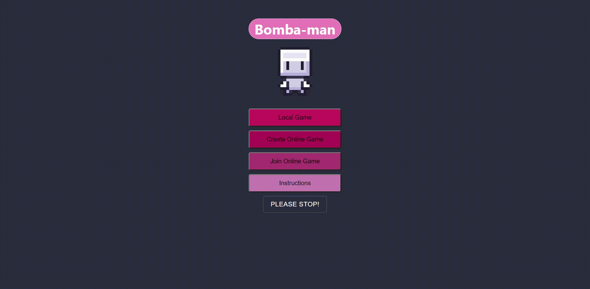
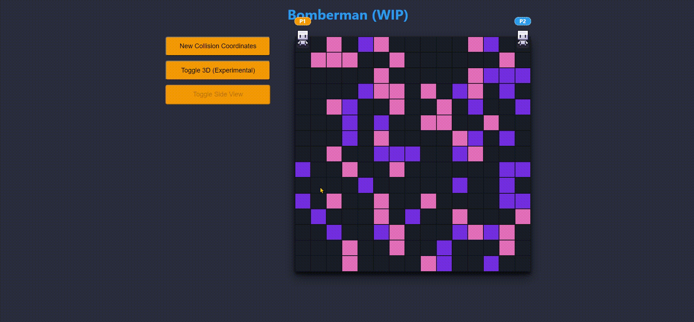
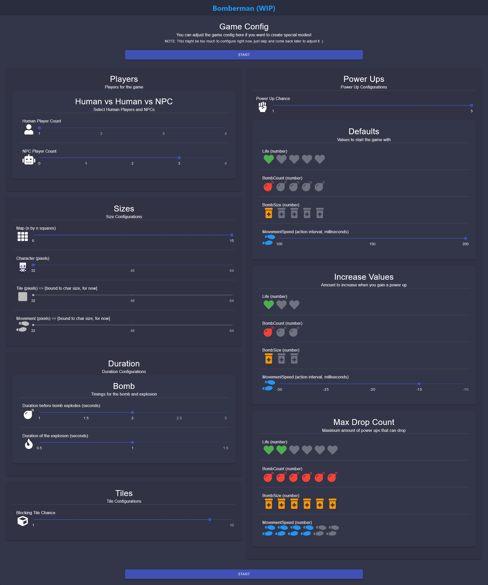
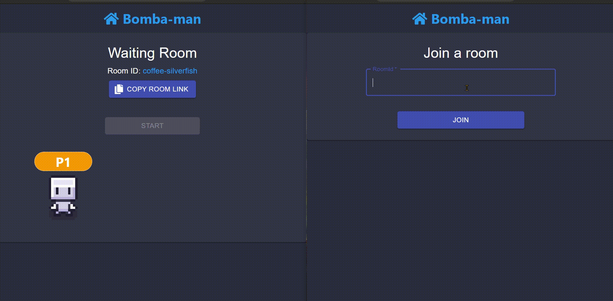
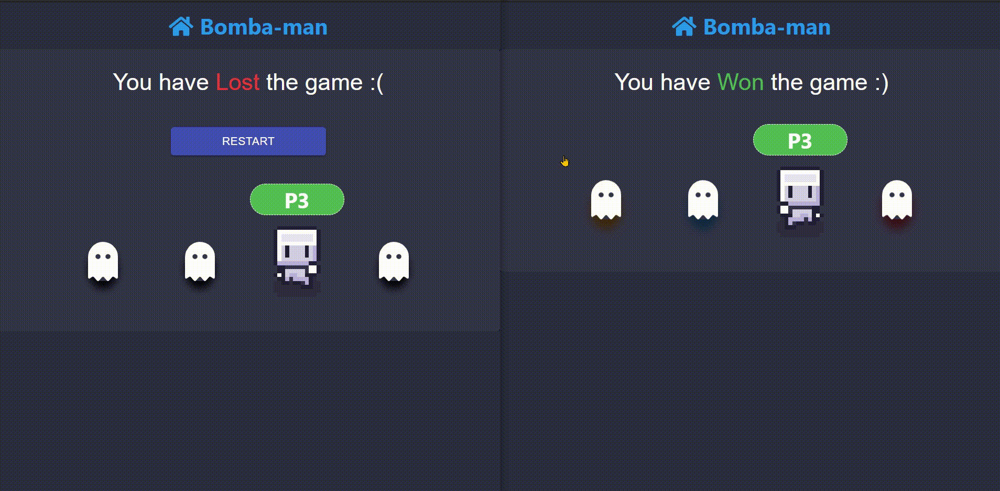
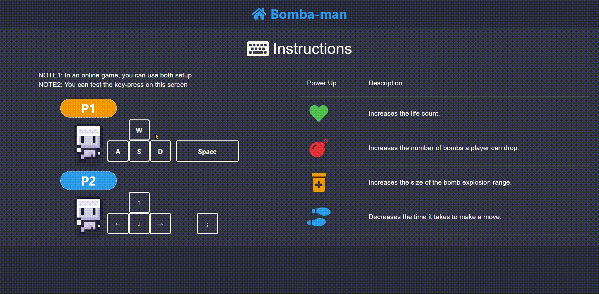

# bomba-man
- Live at: [git.io/bomba-man](https://numanaral.github.io/bomba-man/)
- Fun side project, built purely with web without using WebGL or any game library/framework
- Online/Local multi-player
- Configurable game mode
- NPC *(Shoutout to [Pujan Bhatta](https://github.com/pujaaan))*
- Game API built based on factory pattern
	- Any provider can easily extend and create a wrapper following the factory
		- redux (local) and firebase (online) are the two providers as of now
		- Chose firebase for easy setup + easy auth, but a node server with socket.io is what I plan to implement in the future. I didn't want to deploy a server just yet and just get it up and running, firebase can be integrated on a static app so it's perfect to get the ground up.
- Inspiration & Sprite Credit: [Danger Crew](https://thedangercrew.com/) and [@drewconley](https://www.youtube.com/c/drewconley)

#### Landing Page

#### Game Screens

#### Experimental 3D (via perspective)

#### Room Creator

#### Waiting Room For Online Multi-Player

#### End Game

#### Instructions

